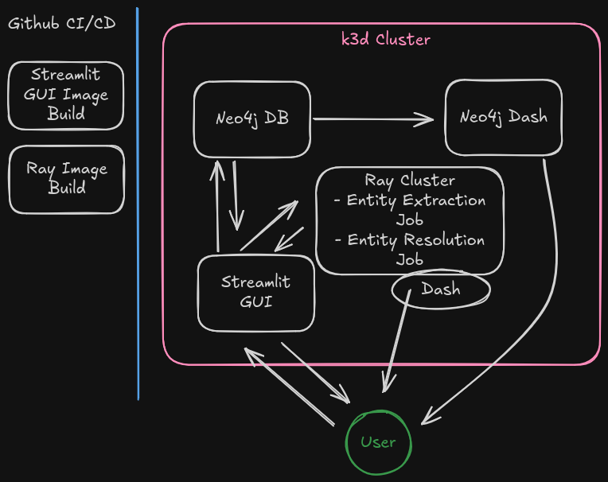
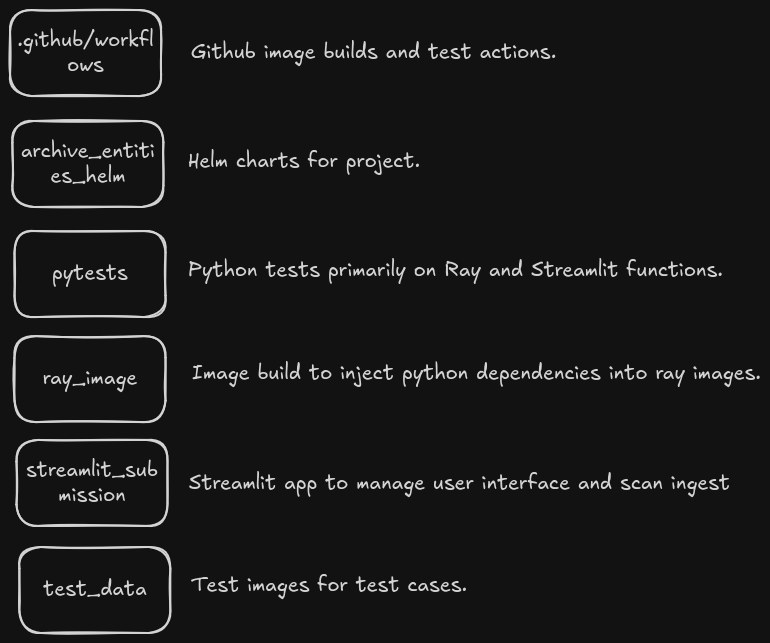

# Archive Entities

## Aim

The purpose of this repository is to demonstrate the uses of:
- Ray
- Devops Pipelines
- K8s and Docker
- Python for Data Processing / Wrangling

The background on this project is that my dad has recently gotten very into family genealogy. A common issue he faces is the digitization and triage of low quality scans or hand written records like births deaths and marriages, and parish records.

The workflow this repository enables is providing a simple GUI for him to upload these documents into. Text is then extracted from them using OCR, entities extracted from these texts, and then all of this mapped in a neo4j database with a dashboard for triage.

## Structure

### Project Structure



### Repository Structure



## How to run

### Pre-requisites

1) Docker

2) Helm

Kubectl

3) Internet Access

### Running Locally

1) First run the below command to stand up the cluster and associated applications. Note: some additional configuration may be required to get the ports to line up for local K3D ingress.

```
make standup

```

2)

3)
```
make standdown
```

Please ensure that the README.md is concise and
suitably descriptive.